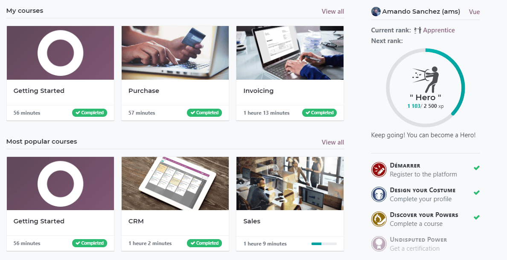
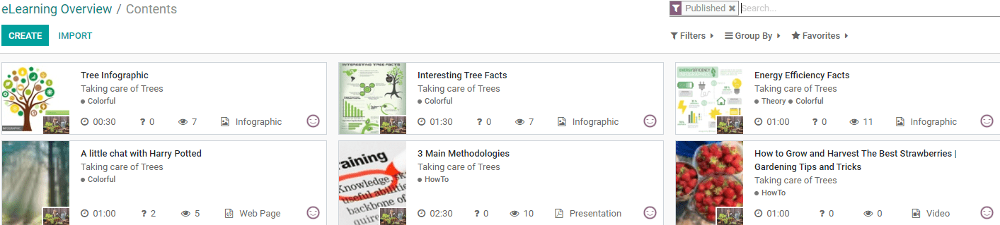

======================
Elearning Introduction
======================

Online learning has been on the rise in recent years, and it’s not really hard to see why.
eLearning courses are more convenient than traditional face to face courses. Students can fit them around their existing
responsibilities and commitments, allowing them to engage with content and extra learning materials whenever is most
convenient to them.
And not only that: students can save time commuting as they can simply log in to their virtual classes from the comfort
of their home or office!

Odoo Elearning is the perfect way to teach remotely, create as many courses as you have topics to teach.

Add all kinds of content to your courses: videos, PDF presentations, infographics, web pages, quizzes, and
certifications.

Keeping track of student participation and understanding in the course is easy thanks to reporting tools present on
Odoo-Elearning.
Students can also easily engage with each other or ask you questions about the lessons thanks to the forums available
for each lesson.

Features
========

* **Create** : Add all kinds of content to your courses: videos, PDF presentations, infographics, web pages, quizzes,
  and certifications.
* **Evaluate** : Create quizzes with a wide variety of question types, Certification to assess student progress.
* **Feedback** : With Forums, Reviews and Mass mailing interacting with the students has never been easier.
* **Reporting** : Keep track of participation in the course with easy to understand indicators of completion and
  progress. Get advanced reports about the performances of your courses, contents, revenues, reviews, quizzes, forums, and
  certifications.
* **Sell your courses** : Sell courses of certifications online.
* **Gamification** : Gamify your courses and reward your community with karma points to keep them active and give them
  access to new ranks and rewards.

Overview
========

This documentation will go over the following topics.

* How can you get started with your first course?
* Use of pedagogical tools such as Videos, Web pages, Presentations and  Documents for students.
* Measuring participation and feedback via forums, quizzes and certifications. - These require additional apps.
* Sell your courses Online.
* Checking up on the progress of your students.

**Easy to use and efficient, Odoo eLearning is the perfect Learning Management System (LMS)!**